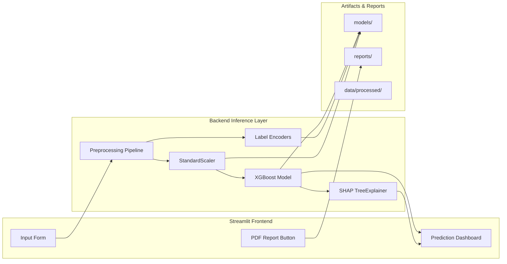

  

<h1 align="center">🧠 Autism Diagnostic Support System</h1>

<b>XGBoost · SHAP Explainability · Apple-Health Inspired UI</b>

  
  
  
  

## 📑 Table of Contents

1. [Executive Summary](#executive-summary)
2. [Problem Statement](#problem-statement)
3. [Why Autism Detection Matters](#why-autism-detection-matters)
4. [Dataset Description](#dataset-description)
5. [Project Pipeline (ML Workflow)](#project-pipeline-ml-workflow)
6. [System Architecture](#system-architecture)
7. [Model Performance & Comparison](#model-performance--comparison)
8. [Explainability (SHAP)](#explainability-shap)
9. [Streamlit App UI Preview](#streamlit-app-ui-preview)
10. [PDF Report Example](#pdf-report-example)
11. [System Design Overview](#system-design-overview)
12. [How to Run Locally](#how-to-run-locally)
13. [Project Features](#project-features)
14. [Clinical Disclaimer](#clinical-disclaimer)
15. [Folder Structure](#folder-structure)
16. [Model Card (XGBoost)](#xgboost-model-card)
17. [Limitations](#limitations)
18. [What I Learned](#what-i-learned)
19. [About the Author](#about-the-author)

## ⭐1. Executive Summary

This project delivers a complete end-to-end **Autism Diagnostic Support System** powered by an 
optimized **XGBoost model**, **SHAP explainability**, and a premium **Apple-Health-inspired UI**.  
It transforms the AQ-10 screening questionnaire into an interactive risk-estimation tool with:

- 🧠 Real-time ASD probability prediction  
- 🎯 Transparent SHAP feature attributions  
- 🩺 Clean clinical-style interface  
- 📄 Auto-generated PDF reports  
- ⚡ A fully reproducible ML pipeline + documentation  

It is designed for **learning**, **research demonstration**, and **portfolio value** — not for clinical diagnosis.  

## ⭐2. Problem Statement

Millions of individuals remain undiagnosed or diagnosed late for Autism Spectrum Disorder (ASD) due to:

- Limited access to clinical specialists  
- Long waiting periods for assessments  
- Lack of awareness or hesitation to seek help  
- Resource constraints in low-income regions  

The challenge:  
**How can we build a fast, transparent, accessible tool to support early ASD screening — without replacing clinical evaluation?**

This project answers that by building a responsible, explainable ML-based support system using the AQ-10 screening questionnaire.

## ⭐3. Why Autism Detection Matters

- ASD affects approximately **1 in 100 people** globally  
- Early identification improves communication, social, and learning outcomes  
- Screening gaps exist in rural and low-resource healthcare systems  
- Digital tools can help triage cases early  
- Machine learning can support clinicians — not replace them  

This project demonstrates how **XAI + ML** can enhance early screening accessibility.

## ⭐4. Dataset Description

**Source:**  
UCI / Kaggle — Autism Screening Adults & Children Dataset

**Dataset Type:**  
Questionnaire-based binary classification (ASD vs Non-ASD)

**Contents:**
- **AQ-10** questionnaire (10 binary questions)
- **Demographics:**  
  age, gender, ethnicity, country of residence  
- **Medical factors:** jaundice at birth  
- **Social factors:** relation (parent/self), used autism app before  
- **Target:** `class_asd`

**Size:** ~700 samples  
**Features:** 19  
**Label distribution:** Balanced enough for supervised learning

📌 **Note:**  
The dataset is **small and highly separable** because AQ-10 questions are directly diagnostic.  
This explains the unusually high performance of ML models.

## ⭐5. Project Pipeline (ML Workflow)

    A[Raw Data (UCI/Kaggle AQ-10)] --> B[Data Cleaning]
    B --> C[Feature Engineering (age_group, encoding)]
    C --> D[Label Encoding]
    D --> E[Train-Test Split]
    E --> F[Model Training (XGBoost)]
    F --> G[Evaluation (Accuracy, F1, AUC)]
    G --> H[SHAP Explainability (Local + Global)]
    H --> I[Streamlit App (Apple Health UI)]
    I --> J[PDF Report Generator]
    
## ⭐6. System Architecture Diagram

