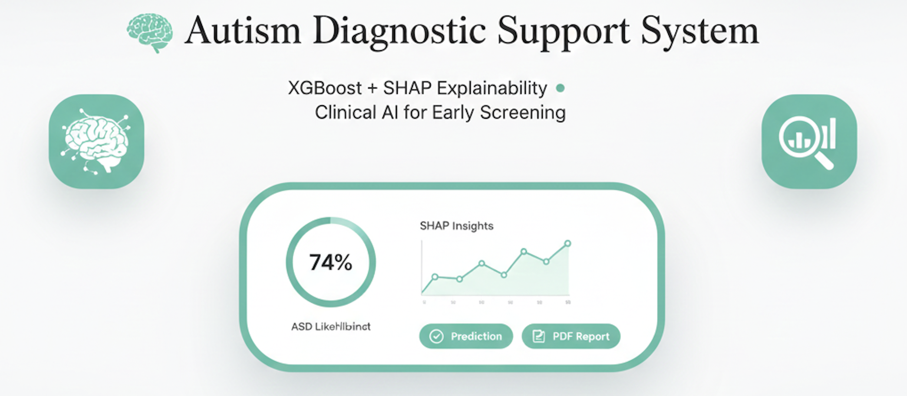
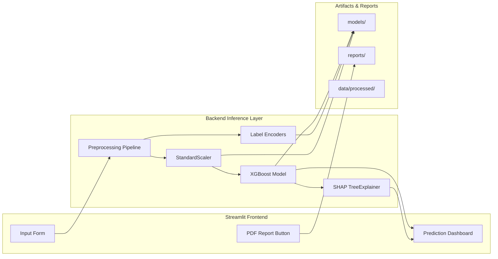
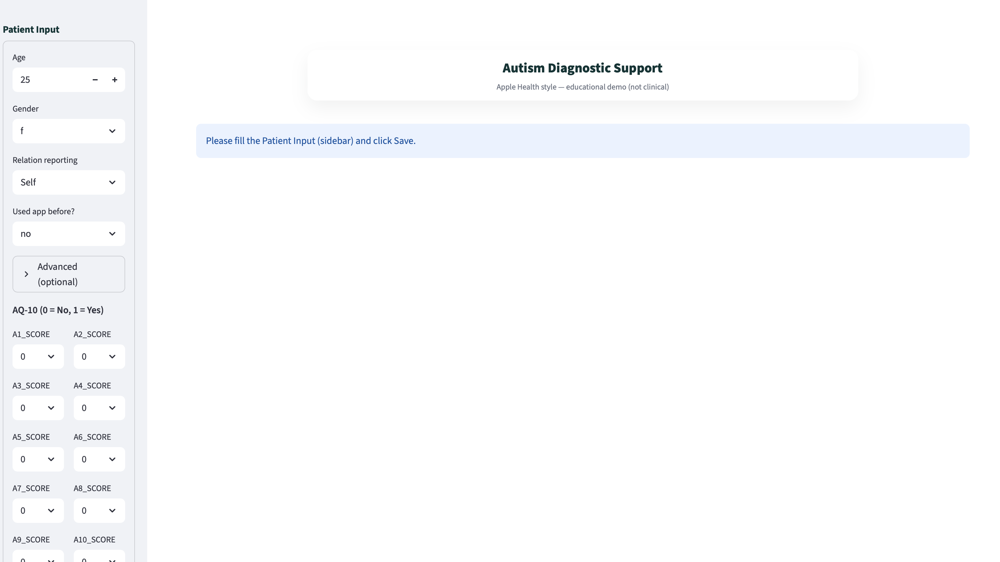
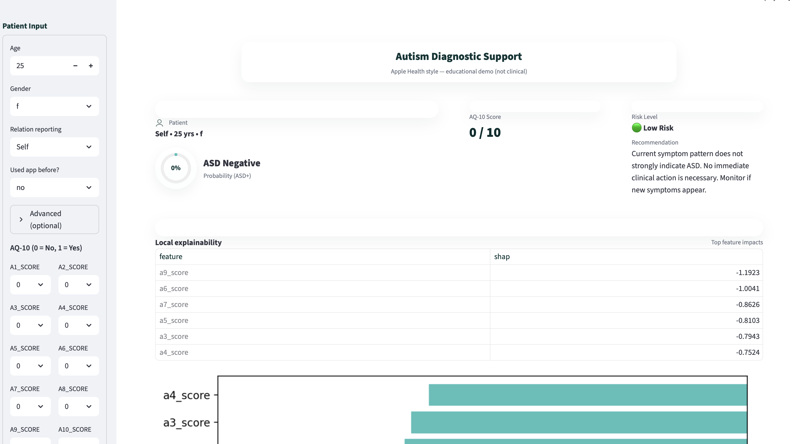
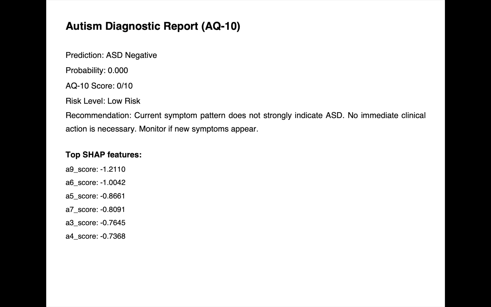
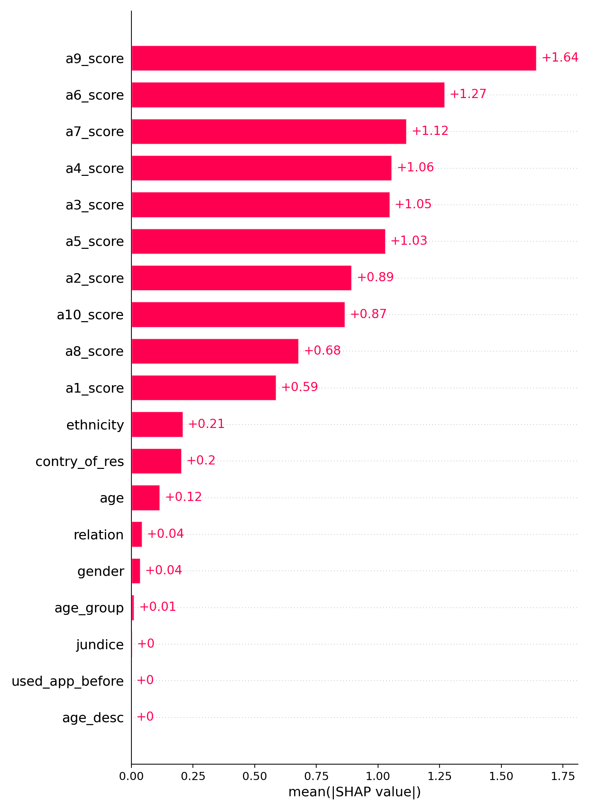
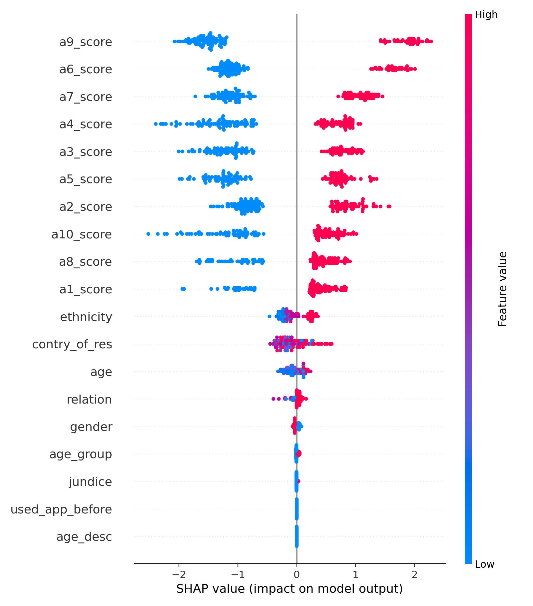
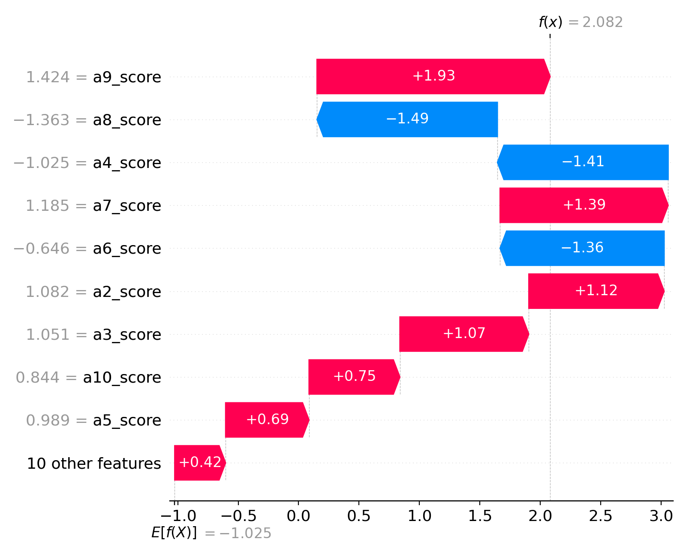
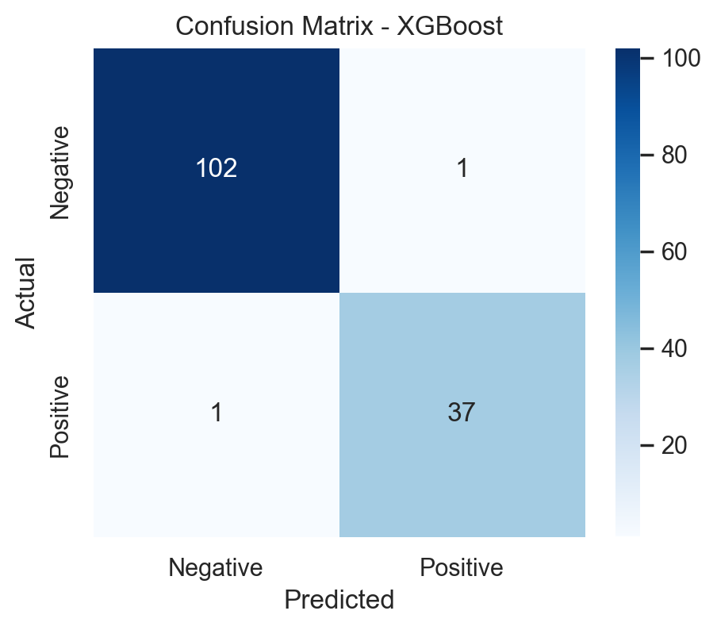
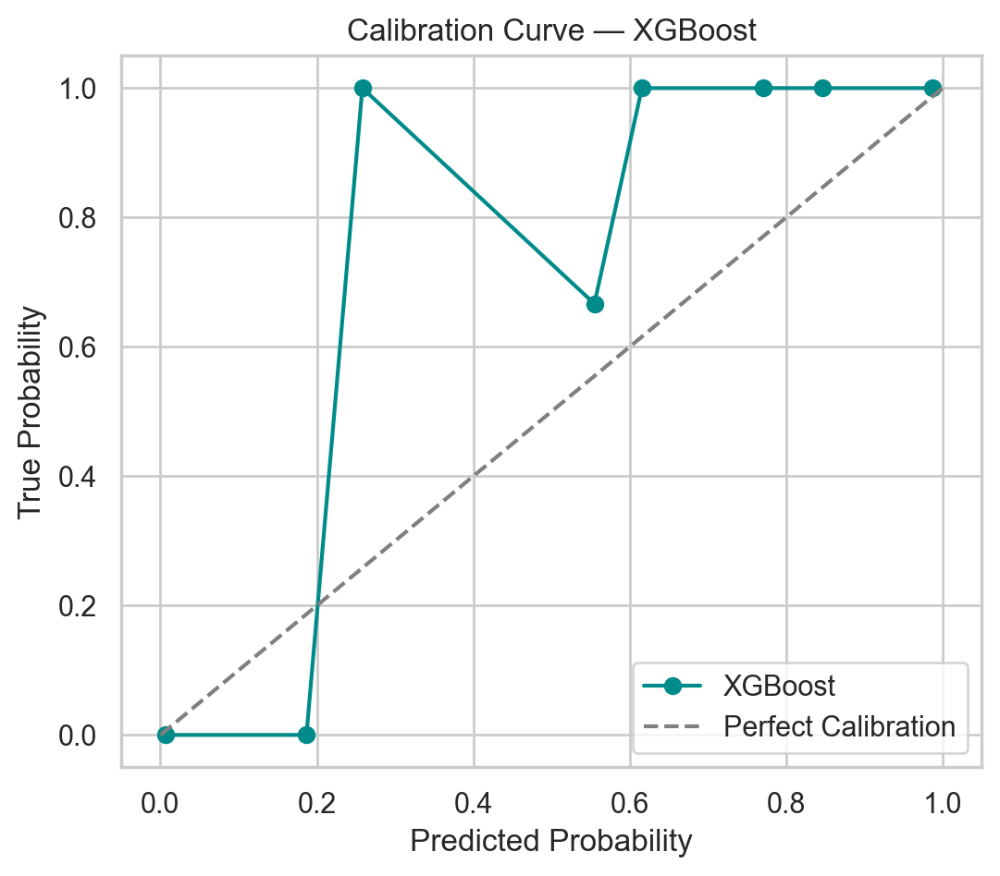

<p align="center">
  
</p>

<h1 align="center">🧠 Autism Diagnostic Support System</h1>
<p align="center"><b>XGBoost · SHAP Explainability · Apple-Health Inspired UI</b></p>

<p align="center">
  
  
  
  
</p>

<p align="center">
  <a href="https://autism-diagnostic-support-tool-2rngfswshayeyl7tghwwpt.streamlit.app/">
    
  </a>
</p>

<div align="center">
  <table>
    <tr>
      <td align="center" width="800">
        <h2>🌟Executive Summary</h2>
        <p>
          A full end-to-end ML system for ASD screening using AQ-10 questionnaire data.
          Includes XGBoost classifier, SHAP interpretability, Apple-Health-style UI,
          and clinical-grade PDF reporting. Built as an impressive, production-quality
          portfolio project demonstrating ML engineering, data pipelines, explainability,
          UI engineering, and deployment.
        </p>
      </td>
    </tr>
  </table>
</div>

## 📑 Table of Contents

1. [1. Problem Statement](#1.problem-statement)
2. [2. Why Autism Detection Matters](#2.why-autism-detection-matters)
3. [3. Dataset Description](#3.dataset-description)
4. [4. Project Pipeline (ML Workflow)](#4.project-pipeline-ml-workflow)
5. [5. System Architecture](#5.system-architecture)
6. [6. Model Performance & Comparison](#6.model-performance--comparison)
7. [7. Explainability (SHAP)](#7.explainability-shap)
8. [8. Streamlit App UI Preview](#8.streamlit-app-ui-preview)
9. [9. Project Features](#9.project-features)
10. [10. How to Run Locally](#10.how-to-run-locally)
11. [11. Folder Structure](#11.folder-structure)
12. [12. Clinical Disclaimer](#12.clinical-disclaimer)
13. [13. Limitations](#13.limitations)
14. [14. Contact](#14.contact)

## 1. Problem Statement

Millions of individuals remain undiagnosed or diagnosed late for Autism Spectrum Disorder (ASD) due to:

- Limited access to clinical specialists  
- Long waiting periods for assessments  
- Lack of awareness or hesitation to seek help  
- Resource constraints in low-income regions  

The challenge:  
**How can we build a fast, transparent, accessible tool to support early ASD screening — without replacing clinical evaluation?**

This project answers that by building a responsible, explainable ML-based support system using the AQ-10 screening questionnaire.

## 2. Why Autism Detection Matters

- ASD affects approximately **1 in 100 people** globally  
- Early identification improves communication, social, and learning outcomes  
- Screening gaps exist in rural and low-resource healthcare systems  
- Digital tools can help triage cases early  
- Machine learning can support clinicians — not replace them  

This project demonstrates how **XAI + ML** can enhance early screening accessibility.

## 3. Dataset Description

**Source:**  
UCI / Kaggle — Autism Screening Adults & Children Dataset

**Dataset Type:**  
Questionnaire-based binary classification (ASD vs Non-ASD)

**Contents:**
- **AQ-10** questionnaire (10 binary questions)
- **Demographics:**  
  age, gender, ethnicity, country of residence  
- **Medical factors:** jaundice at birth  
- **Social factors:** relation (parent/self), used autism app before  
- **Target:** `class_asd`

**Size:** ~700 samples  
**Features:** 19  
**Label distribution:** Balanced enough for supervised learning

📌 **Note:**  
The dataset is **small and highly separable** because AQ-10 questions are directly diagnostic.  
This explains the unusually high performance of ML models.


## 4. Project Pipeline (ML Workflow)


    subgraph PREP[Data Preparation]
        A1[Raw Data]
        A2[Cleaning]
        A3[Feature Engineering]
        A4[Encoding]
        A5[Train-Test Split]
        A1 --> A2 --> A3 --> A4 --> A5
    end

    subgraph MODEL[Modeling]
        B1[XGBoost Training]
        B2[Evaluation]
        B3[SHAP Explainability]
        B1 --> B2 --> B3
    end

    subgraph APP[Application Layer]
        C1[Streamlit App]
        C2[PDF Report Generator]
    end

    A5 --> B1
    B3 --> C1
    C1 --> C2

    
## 5. System Architecture Diagram



## 6. Model Performance & Comparison

| Model                 | Accuracy | F1 Score | Recall | AUC      |
|----------------------|----------|----------|--------|----------|
| Logistic Regression   | 1.00     | 1.00     | 1.00   | 0.99     |
| Random Forest         | 0.94     | 0.89     | 0.84   | 0.996    |
| XGBoost (Chosen)      | **0.986**| **0.974**| **0.974** | **0.9995** |
| Neural Network (MLP)  | 1.00     | 1.00     | 1.00   | 1.00     |

### 🏆 Why XGBoost Was Chosen
- Best trade-off between **accuracy**, **stability**, and **interpretability**
- Works extremely well on **small structured datasets**
- Fully compatible with **TreeSHAP** for transparent explainability
- Fast, robust, and highly generalizable

## 7. Explainability (SHAP)

This project uses **SHAP (SHapley Additive Explanations)** to provide
transparent, interpretable insights into *why* the model predicts
ASD Positive or Negative.

### 🔍 Local SHAP (Per-Patient Explanation)
Shows how each feature contributed to an individual prediction.

Example:

| Feature    | SHAP Value |
|----------- |----------- |
| a9_score   | -1.2110    |
| a6_score   | -1.0042    |
| a5_score   | -0.8661    |
| a7_score   | -0.8091    |
| a3_score   | -0.7645    |
| a4_score   | -0.7368    |

- **Negative SHAP** → pushes toward *ASD Negative*  
- **Positive SHAP** → pushes toward *ASD Positive*  
- **Larger magnitude** → stronger influence

### 🌍 Global Explainability
SHAP also generates global-level insights:

- Which features influence predictions the most?
- How strongly do AQ-10 symptoms contribute?
- How does age or relation reporting affect outcomes?

## 8. Streamlit App — UI Gallery
<details> <summary><strong>📸 Click to expand full UI + SHAP gallery</strong></summary> <br>
  
🏠 Home Dashboard
<p align="center">  </p>

🔍 Prediction View (Model Output)
<p align="center">  </p>

📝 Generated PDF Report
<p align="center">  </p>

🧠 SHAP Explainability

📌 Local Feature Impact (Bar Plot)
<p align="center">  </p>

📌 Global Beeswarm Plot
<p align="center">  </p>

📌 Waterfall (Single Sample)
<p align="center">  </p>

📈 Evaluation Metrics

✔️ Confusion Matrix
<p align="center">  </p>

✔️ ROC Curve
<p align="center">  </p>

✔️ Calibration Curve
<p align="center">  </p>

</details>

## 9. Project Features
<details> <summary><strong>✨ Click to expand Feature Highlights</strong></summary> <br>
  
### 💡 Core Features

ASD Risk Prediction using an optimized XGBoost classifier

Apple-Health Inspired UI with clean, clinical-style cards

Real-time Probability Ring that visualizes ASD+ likelihood

AQ-10 Questionnaire Input (10 binary symptom questions)

Demographic Inputs with encoded categorical features

Dynamic Risk Scoring based on total AQ-10 + age

SHAP Explainability (local + global)

### 🧠 Explainability Features

Local SHAP force explanation (per patient)

Global beeswarm + bar importance plots

Waterfall plot for individual predictions

Top 6 contributing features displayed in-dashboard

### 📄 PDF Report Generator

Exports a clinical-style report containing:

Prediction

Probability

AQ-10 score

Risk level

Recommendation

Top SHAP contributions

Great for portfolio + recruiters.

### 📚 Machine Learning Pipeline

Preprocessing: encoding + feature engineering

Train/test split

XGBoost model training

ROC, AUC, confusion matrix, calibration

Serialized model artifacts saved in /models/

### 🧪 Evaluation & Model Monitoring

Confusion Matrix

ROC Curve

Calibration Curve

Model Comparison Table

SHAP-based auditing

### 🏗️ Software Architecture Highlights

Clear separation of concerns (src/, app/, models/, notebooks/)

Production-like artifact loading in Streamlit

Modular risk scoring function

Explainability integrated into UI

### 🚀 Deployment-Ready

Fully packaged Streamlit app

GitHub-friendly structure

Works locally or on cloud platforms (Streamlit Cloud)

</details>

## 10. How to Run Locally

Follow the steps below to run the Autism Diagnostic Support System on your machine.

1. Clone the Repository

```bash
git clone https://github.com/aparnaworkspace/autism-diagnostic-support-tool
cd autism-diagnostic-support-tool
```

2. Create and Activate a Virtual Environment

```bash
python3 -m venv venv
source venv/bin/activate
```
(Windows users: venv\Scripts\activate)

3. Install Dependencies

```bash
pip install -r requirements.txt
```

4. Run the Streamlit Application

```bash
streamlit run app/streamlit_app.py
```

5. Regenerate SHAP Explainability Visuals

If you want fresh SHAP plots (bar, beeswarm, waterfall):

```bash
python notebooks/04_Model_Evaluation.py
```

6. Jupyter Notebook Workflow

To explore EDA or model training:

```bash
jupyter lab
```

## 11. Folder Structure

A well-structured, production-style codebase:

```
autism-diagnostic-support-tool/
│
├── app/
│   └── streamlit_app.py
│
├── assets/
│   ├── home.png
│   ├── prediction.png
│   ├── pdf_report.png
│   ├── shap_bar.png
│   ├── shap_beeswarm.png
│   ├── shap_waterfall_sample_0.png
│   ├── confusion_matrix.png
│   ├── calibration_curve.png
│   └── roc_curve.png
│
├── data/
│   ├── raw/
│   │   ├── autism_screening.csv
│   │   └── Autism-Child-Data.csv
│   └── processed/
│       ├── autism_combined.csv
│       ├── X_train.csv
│       ├── X_test.csv
│       ├── y_train.csv
│       └── y_test.csv
│
├── models/
│   ├── best_model.pkl
│   ├── scaler.pkl
│   ├── label_encoders.pkl
│   └── shap_explainer_and_values.pkl
│
├── notebooks/
│   ├── 01_EDA.ipynb
│   ├── 02_Feature_Engineering.ipynb
│   ├── 03_Model_Training.ipynb
│   └── 04_Model_Evaluation.ipynb
│
├── reports/
│   ├── confusion_matrix.png
│   ├── roc_curve.png
│   ├── calibration_curve.png
│   └── *.pdf
│
├── src/
│   ├── preprocess.py
│   ├── train_model.py
│   ├── risk_scoring.py
│   └── explainability.py
│
├── docs/
│   ├── MODEL_CARD.md
│   ├── DATA_CARD.md
│   ├── MODEL_COMPARISON.md
│   ├── SYSTEM_ARCHITECTURE.md
│   └── ETHICS_CARD.md
│
├── requirements.txt
└── README.md
```
## 12. Clinical Disclaimer

⚠️ This tool is NOT a diagnostic system.

It is an educational machine-learning project designed for:

research demonstration

explainability exploration (SHAP)

portfolio and skill showcasing

Autism Spectrum Disorder (ASD) diagnosis requires trained clinicians and involves:

behavioural observation

developmental history

structured clinical interviews

neuropsychological assessments

multi-disciplinary evaluation

genetics & neurological analysis

No machine-learning model, screening questionnaire, or digital tool can replace professional evaluation.
This project should not be used for medical, clinical, or therapeutic decision-making.

## 13. Limitations

Despite strong performance, the project has important limitations that recruiters and reviewers should know:

Dataset Limitations

Small dataset (≈700 samples)

Questionnaire-based (AQ-10) → inherently diagnostic

Limited feature variety (binary responses, demographics)

May contain cultural or demographic biases

Does not include real-world behavioural, video, audio, MRI, or genetic data

Model Limitations

High accuracy partly due to dataset separability

May not generalize to unseen populations or clinical settings

No temporal, behavioural, or contextual signals

Risk of overfitting due to small sample size

Application Limitations

UI is for demonstration only (not medically approved)

SHAP helps explain decisions but does not guarantee model fairness

PDF reports are educational summaries, not clinical documents

## 14. Contact
If you’d like to connect or discuss this project:
📧 aparnasajeevan16@gmail.com 
🔗 LinkedIn:www.linkedin.com/in/aparnasajeevan1610

