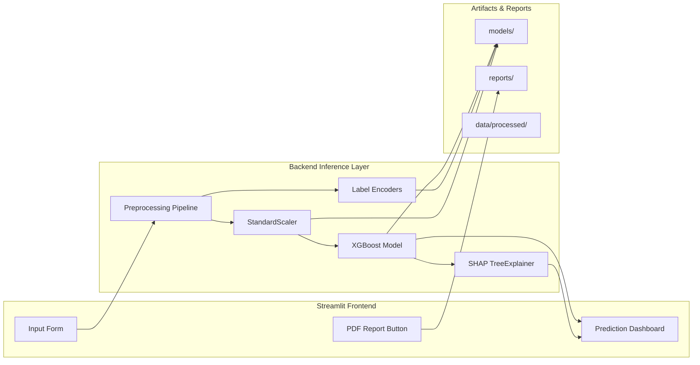

  

<h1 align="center">🧠 Autism Diagnostic Support System</h1>

<b>XGBoost · SHAP Explainability · Apple-Health Inspired UI</b>

  
  
  
  

## 📑 Table of Contents

1. [Executive Summary](#executive-summary)
2. [Problem Statement](#problem-statement)
3. [Why Autism Detection Matters](#why-autism-detection-matters)
4. [Dataset Description](#dataset-description)
5. [Project Pipeline (ML Workflow)](#project-pipeline-ml-workflow)
6. [System Architecture](#system-architecture)
7. [Model Performance & Comparison](#model-performance--comparison)
8. [Explainability (SHAP)](#explainability-shap)
9. [Streamlit App UI Preview](#streamlit-app-ui-preview)
10. [Project Features](#project-features)
11. [How to Run Locally](#how-to-run-locally)
12. [Folder Structure](#folder-structure)
13. [Clinical Disclaimer](#clinical-disclaimer)
14. [Limitations](#limitations)

## Executive Summary

This project delivers a complete end-to-end **Autism Diagnostic Support System** powered by an 
optimized **XGBoost model**, **SHAP explainability**, and a premium **Apple-Health-inspired UI**.  
It transforms the AQ-10 screening questionnaire into an interactive risk-estimation tool with:

- 🧠 Real-time ASD probability prediction  
- 🎯 Transparent SHAP feature attributions  
- 🩺 Clean clinical-style interface  
- 📄 Auto-generated PDF reports  
- ⚡ A fully reproducible ML pipeline + documentation  

It is designed for **learning**, **research demonstration**, and **portfolio value** — not for clinical diagnosis.  

## Problem Statement

Millions of individuals remain undiagnosed or diagnosed late for Autism Spectrum Disorder (ASD) due to:

- Limited access to clinical specialists  
- Long waiting periods for assessments  
- Lack of awareness or hesitation to seek help  
- Resource constraints in low-income regions  

The challenge:  
**How can we build a fast, transparent, accessible tool to support early ASD screening — without replacing clinical evaluation?**

This project answers that by building a responsible, explainable ML-based support system using the AQ-10 screening questionnaire.

## Why Autism Detection Matters

- ASD affects approximately **1 in 100 people** globally  
- Early identification improves communication, social, and learning outcomes  
- Screening gaps exist in rural and low-resource healthcare systems  
- Digital tools can help triage cases early  
- Machine learning can support clinicians — not replace them  

This project demonstrates how **XAI + ML** can enhance early screening accessibility.

## Dataset Description

**Source:**  
UCI / Kaggle — Autism Screening Adults & Children Dataset

**Dataset Type:**  
Questionnaire-based binary classification (ASD vs Non-ASD)

**Contents:**
- **AQ-10** questionnaire (10 binary questions)
- **Demographics:**  
  age, gender, ethnicity, country of residence  
- **Medical factors:** jaundice at birth  
- **Social factors:** relation (parent/self), used autism app before  
- **Target:** `class_asd`

**Size:** ~700 samples  
**Features:** 19  
**Label distribution:** Balanced enough for supervised learning

📌 **Note:**  
The dataset is **small and highly separable** because AQ-10 questions are directly diagnostic.  
This explains the unusually high performance of ML models.

## Project Pipeline (ML Workflow)

    subgraph PREP[Data Preparation]
        A1[Raw Data]
        A2[Cleaning]
        A3[Feature Engineering]
        A4[Encoding]
        A5[Train-Test Split]
        A1 --> A2 --> A3 --> A4 --> A5
    end

    subgraph MODEL[Modeling]
        B1[XGBoost Training]
        B2[Evaluation]
        B3[SHAP Explainability]
        B1 --> B2 --> B3
    end

    subgraph APP[Application Layer]
        C1[Streamlit App]
        C2[PDF Report Generator]
    end

    A5 --> B1
    B3 --> C1
    C1 --> C2

    
## System Architecture Diagram

## 7. Model Performance & Comparison

| Model                 | Accuracy | F1 Score | Recall | AUC      |
|----------------------|----------|----------|--------|----------|
| Logistic Regression   | 1.00     | 1.00     | 1.00   | 0.99     |
| Random Forest         | 0.94     | 0.89     | 0.84   | 0.996    |
| XGBoost (Chosen)      | **0.986**| **0.974**| **0.974** | **0.9995** |
| Neural Network (MLP)  | 1.00     | 1.00     | 1.00   | 1.00     |

### 🏆 Why XGBoost Was Chosen
- Best trade-off between **accuracy**, **stability**, and **interpretability**
- Works extremely well on **small structured datasets**
- Fully compatible with **TreeSHAP** for transparent explainability
- Fast, robust, and highly generalizable

## Explainability (SHAP)

This project uses **SHAP (SHapley Additive Explanations)** to provide
transparent, interpretable insights into *why* the model predicts
ASD Positive or Negative.

### 🔍 Local SHAP (Per-Patient Explanation)
Shows how each feature contributed to an individual prediction.

Example:

| Feature    | SHAP Value |
|----------- |----------- |
| a9_score   | -1.2110    |
| a6_score   | -1.0042    |
| a5_score   | -0.8661    |
| a7_score   | -0.8091    |
| a3_score   | -0.7645    |
| a4_score   | -0.7368    |

- **Negative SHAP** → pushes toward *ASD Negative*  
- **Positive SHAP** → pushes toward *ASD Positive*  
- **Larger magnitude** → stronger influence

### 🌍 Global Explainability
SHAP also generates global-level insights:

- Which features influence predictions the most?
- How strongly do AQ-10 symptoms contribute?
- How does age or relation reporting affect outcomes?

### 📊 SHAP Visuals (Included in /reports/)
-— Top feature importance  
-— Global distribution of feature impact  
- — Detailed breakdown for one patient

These visuals improve *trust, accountability, and transparency* in
machine learning decisions.

## Streamlit App UI Preview

The application is designed in a **clean, Apple-Health inspired interface**  
with soft white cards, rounded corners, teal accents, and clear readability.

### Home / Prediction Dashboard
Shows:
- Patient summary  
- Probability ring  
- AQ-10 score card  
- Risk level card  
- SHAP feature explanation  

---

### Patient Input Form
Features:
- Age, gender and relation reporting  
- Optional advanced demographics  
- AQ-10 (0/1) questionnaire  
- “Save Input” sidebar workflow  

---

### SHAP Explanation Section
Provides:
- Top feature contributions  
- Local explanation table  
- Bar chart
  

---

### PDF Report Generator
One-click clinical-style PDF including:
- Prediction  
- Probability  
- Risk level  
- AQ-10 score  
- Recommendations  
- SHAP feature list  

